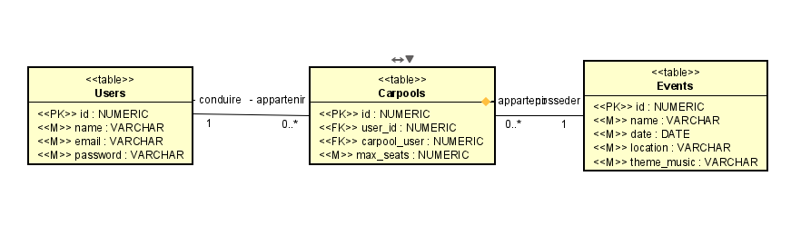
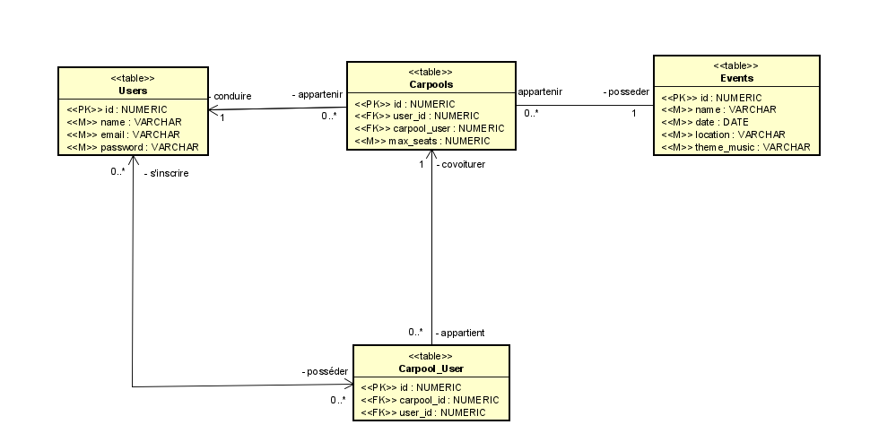
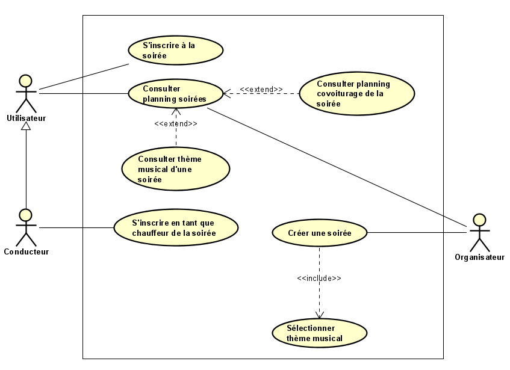

<h1>NightBuddy 🚗🎶</h1>

Dans le cadre du cours <strong>C732</strong> (gestion), nous devions réaliser un cahier des charges et un Proof of Concept (POC). Nous avons choisi de développer <strong>NightBuddy</strong>, un site et une API pour le covoiturage lors d’événements nocturnes. L’objectif est de faciliter les déplacements vers les événements et d’encourager le covoiturage. Les compétences acquises parallèlement dans le cours <strong>C132-API</strong> nous ont aidé à accomplir cet objectif.

Les organisateurs d’événements peuvent intégrer cette API à leurs sites web pour encourager les participants à utiliser le covoiturage et ainsi rendre les événements plus accessibles, tout en réduisant les contraintes liées à la conduite.

    

<a href="https://laravel.com/docs/11.x/fortify" target="_blank">Documentation Fortify</a>

<a href="Doc/Presentation/video-demo-night-buddy.mkv">Lien vers la démo de Night Buddy en vidéo</a>

<h2>Objectifs</h2>

<ul>
    <li><strong>Faciliter les déplacements nocturnes</strong>: Gestion du covoiturage pour les événements. Coordination simplifiée entre participants.</li>
    <li><strong>API pour les organisateurs</strong>: Créer, gérer et partager des événements via une API. Solution réutilisable pour différents types d’événements.</li>
    <li><strong>Thèmes musicaux personnalisables</strong>: Les organisateurs peuvent configurer les thèmes musicaux selon leurs préférences.</li>
</ul>

<h2>Fonctionnalités principales</h2>

<ul>
    <li><strong>Création et gestion d’événements</strong>: Ajouter/modifier des événements avec nom, lieu, date et thèmes musicaux.</li>
    <li><strong>Covoiturage</strong>: Conducteurs - Proposer des trajets. Participants - Réserver une place en fonction des disponibilités.</li>
    <li><strong>Gestion des utilisateurs</strong>: Inscription, connexion et profils.</li>
    <li><strong>Invitations</strong>: Envoyer et suivre les réponses des invités.</li>
</ul>

<h2>Modèles</h2>

Modèle Conceptuel de Données (MCD):

    

Modèle Logique de Données (MLD):

    

Use Case :

    

<h2>Technologies utilisées</h2>

<ul>
    <li><strong>Framework</strong>: Laravel 10.48.25</li>
    <li><strong>Authentification</strong>: Laravel Fortify</li>
    <li><strong>Base de données</strong>: MySQL</li>
    <li><strong>Organisation</strong>: Kanban via Microsoft Teams</li>
</ul>

<h2>Ce que nous avons appris</h2>

<ul>
    <li><strong>Laravel</strong>: Nous avons appris à utiliser Laravel en parallèle du projet, grâce au cours C132-API. Ce projet nous a permis de consolider nos connaissances.</li> 
    <li><strong>Fortify</strong>: Nous avons utilisé Fortify pour simplifier l’authentification. Cette bibliothèque s’est avérée simple d’utilisation et nous a permis d’apprendre une nouvelle compétence que nous n’avions jamais utilisée auparavant.</li>
    <li><strong>Organisation avec Kanban</strong>: Nous manquions de connaissances au début, et nous avons utilisé un Kanban dans Microsoft Teams pour gérer les tâches au fil de l’avancement. Cela nous a permis d’avancer étape par étape et d’ajouter des tâches au fur et à mesure. Nous n’aurions pas pu utiliser un diagramme de Gantt, par exemple, car nous n’avions pas suffisamment de connaissances pour planifier les tâches au départ.</li>
    <li><strong>API et approche</strong>: Nous avons eu l'opportunité de consilider nos connaissances sur les APIs.</li>
</ul>

<h2>Fonctionnalités manquées (pour le futur)</h2> 
<ul> 
	<li><strong>Modification des tables</strong>: Pour rendre l'application pleinement fonctionnelle, il aurait été nécessaire d'ajouter des attributs supplémentaires ainsi que de nouvelles tables. Par exemple, inclure l'adresse complète des utilisateurs ou créer une table associative pour les points de rendez-vous, etc...</li>
    <li><strong>Intégration Google Maps</strong>: Nous avons voulu intégrer Google Maps pour la gestion des lieux et itinéraires de covoiturage, mais avons été freinés par les coûts. Nous avons cherché des alternatives gratuites, mais cela n’a pas été conclu en raison du manque de temps.</li>
    <li><strong>Séparation des contrôleurs API et web</strong>: Nous aurions dû séparer les contrôleurs API et web pour une meilleure organisation et gestion des routes. Cette séparation aurait permis une meilleure modularité et une gestion plus claire des routes dédiées à l’API et celles liées à l’application web. Cependant, en raison du manque de temps, nous avons dû regrouper les deux.</li>
    <li><strong>Utilisation de Sanctum pour l'authentification API</strong>: Nous avions envisagé d’utiliser Sanctum, une bibliothèque que nous avons déjà utilisée dans le cours C132, pour sécuriser les API. Cela aurait permis une authentification simplifiée et sécurisée. Cependant, nous n’avons pas pu mettre en place Sanctum à cause du manque de temps et des coûts associés à l'API de Google Maps.</li>
	<li><strong>Redirections vers des pages appropriées</strong>: Lors de l'enregistrement ou de certaines actions sur le site, nous aurions dû rediriger l'utilisateur vers des pages pertinentes plutôt que d'afficher directement des fichiers JSON. Cela aurait permis une meilleure navigation et une expérience utilisateur plus fluide, en montrant des messages de confirmation ou en dirigeant vers des pages de succès ou d'erreur spécifiques, au lieu de simplement renvoyer du JSON. Cependant, nous avons laissé ces redirections de côté pour illustrer ce qui se passait après chaque enregistrement.</li>
</ul>
 

<h2>Conclusion</h2>

Ce projet a été une expérience enrichissante qui nous a permis de mieux comprendre le processus de création d’une API, de structurer un cahier des charges et de travailler en équipe avec un outil de gestion agile comme Kanban. Nous sommes satisfaits du résultat, notamment grâce à l’apprentissage de Fortify et à la création d’une API fonctionnelle.

<h2>Contributeurs</h2>

Ce projet a été développé par :

<ul>
    <li>Kylian Di Gaetano</li>
    <li>Alexandre Pitarch</li>
</ul>

<h2>Configuration du projet</h2>

<h3>1. Cloner le dépôt</h3>

Clonez le dépôt Git depuis GitHub :

<code>git clone https://github.com/PitarchAlexandre/23-25-C732-NightBuddy.git</code>

<h3>2. Installation des dépendances</h3>

Accédez au répertoire du projet :

<code>cd nightbuddy</code>

Installez les dépendances avec Composer :

<code>composer install</code>

<h3>3. Configuration de l'environnement</h3>

Créez un fichier `.env` basé sur le fichier `.env.example` :

<code>cp .env.example .env</code>

Configurez les paramètres de votre environnement (base de données, clés API, etc.) en modifiant le fichier `.env`.

<h3>4. Générer la clé application</h3>

Pour générer la clé application nécessaire pour le chiffrement, exécutez la commande :

<code>php artisan key:generate</code>

<h3>5. Migration de la base de données</h3>

Exécutez les migrations pour créer la base de données :

<code>php artisan migrate</code>

<h3>6. Insérez des données dans la base de données</h3> 

Exécutez les migrations pour créer la structure de la base de données :

Copiez le fichier SQL situé dans <code>Web/public/inserer_donnees.sql</code>, puis exécutez-le dans votre outil de gestion MySQL. Cela ajoutera automatiquement les données nécessaires à la base de données.

<h3>7. Serveur de développement</h3>

Démarrez votre serveur local (par exemple, Laragon, XAMPP, LAMP, ou tout autre outil de votre choix) pour héberger l'application :

Accédez à l’application via votre navigateur à l’adresse correspondante, généralement : <a href="http://localhost">http://localhost</a>

<h2>À noter</h2> 

Le fichier <strong>Doc</strong> contient des fichiers volumineux, incluant une vidéo et une présentation PowerPoint utilisés lors de notre présentation. Ces fichiers sont disponibles dans le dossier : \Doc\Presentation.

